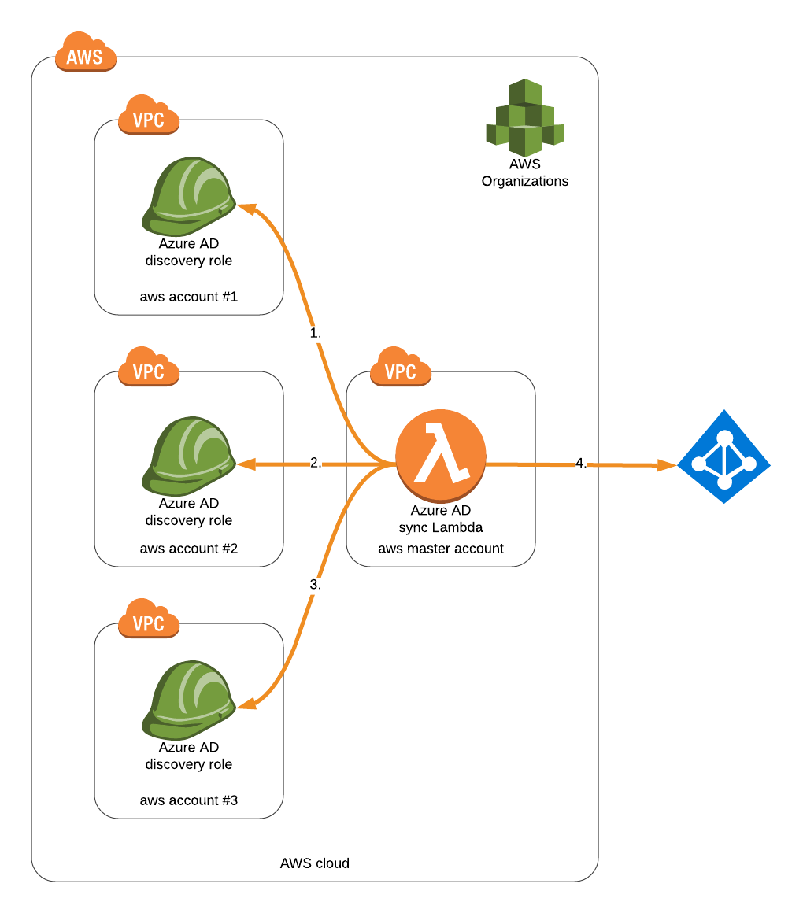

Automating SAML federation from Azure Active Directory to multiple AWS Organizational accounts
============================================================
The following project automates IAM roles syncing process to Azure Active Directory, thus eliminating to manually update 
the Azure SSO app as the roles get added in any of the AWS accounts.

# Implementation
The solution is implemented using a single Lambda function running in the Organization's master account. The Lambda function performs
following activities:
1) Tries to assumes a specified role in each organization's account
2) Retrieves IAM roles (using previously assumed role's credentials) to find ones that can be assumed by SAML provider
3) Disables existing IAM roles in Azure SSO application
4) Puts newly discovered IAM roles, *while preserving local ids*



# Installation
The Lambda function requires following dependencies to be provisioned:
1) Azure AWS SSO app with configured SAML-based sign-on
2) IAM Provider created in each organization's account using SAML document generated in the prev. step
3) *IAM Role provisioned in each organization's account with `iam:ListRoles` policy ([cloudformation](./role.template) provided for this)*

### Initial setup
Please follow the general integration steps described in this [article](https://docs.microsoft.com/en-us/azure/active-directory/saas-apps/aws-multi-accounts-tutorial)
up to step *15.* in *Configure Amazon Web Services (AWS) Single Sign-On* section.
At this stage, you should have Azure AWS SSO application with SAML-based sign-on and IAM Provider provisioned in AWS account(s)

### IAM Role provisioning
In case you already have an IAM role with consistent naming provisioned in each account you can use it as long as it has
`iam:ListRoles` permission. 

Optionally, provision IAM Role in each child account using [following](./role.template) cloudformation. 

Alternatively, you can use AWS pre-provisioned `OrganizationAccountAccessRole` role (FYI: AWS recommends to delete this role).
 
### Lambda configuration
Rename `.envrc.template` to `.envrc` and provide following configuration values:

* `STACK_NAME` - Preferred stack name for provisioning AWS Lambda function
* `S3_BUCKET_NAME` - Existing S3 bucket in the master account, that you have r/w access
* `AWS_ASSUME_ROLE_NAME` - IAM role name that's going to be assued by Lambda function in each organization's account
* `AWS_SAML_PROVIDER_NAME` - IAM Provider name, that was previously provisioned in each organization's account
* `AZURE_OBJECT_ID` - Azure AWS SSO app's objectId, can be found on app's Properties page, see this [screenshot](https://msdnshared.blob.core.windows.net/media/2018/08/image133.png)
* `AZURE_TENANT_ID` - Azure account tenantId, can be found using Azure Cloud Shell `$ az account show` command
* `AZURE_USERNAME` - Active Directory user's login (must have enough permissions to update app) 
* `AZURE_PASSWORD` - Active Directory user's password

Load variables defined in `.envrc` using [direnv](https://github.com/direnv/direnv) or  by simply running `$ source .envrc`

### Initiate stack deployment

```bash
$ make deploy
```